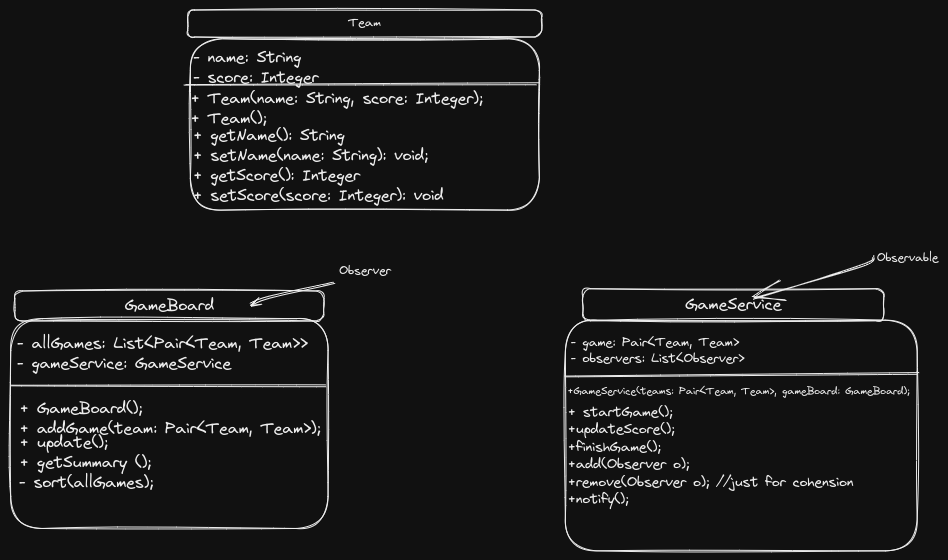

# game-board

 

Simple application to display current sport competition results.
 
## Using application:
Application is my variation of 'Observer pattern'.
- GameService is actual the implementation of 'Observable' interface with methods such as:
  - [x] startGame() - where we initial match between to teams
  - [x] updateScore() - for updating score during the match - in this method all '**Observers**' are nootifing about updating
  - [x] finishGame() - match is removed from board 
  - [x] notifyObservers() - for notifying all '**Observers**' such as GameBoard
  - [x]add/removeObserver() for managing all potential Observers.
- GameBoard - Observer implementation for displaying all already started games.
  - [x] update() method for sorting and displaying current games
  - [x] getSummmary() - for possibility to get all match results at demand
  - [ ] private method sort() for sorting all results regarding to requirements

## Development process
I've tried to keep TDD behaviour and show it via git commits history (Test was written first - then implementation of features).

## Additional 
I've also added additional branch _**tests**_ where I added additional spring dependencies to create endpoints for testing application :)
Although this functionality is not done in 100% yet, feel free to try it via postman!
- **/game/add-team** - adding new Team to repository
- **/game/get-all-teams** - retrieve all teams from repository
- **/game/get-all-games** - retrieve all ongoing games
- **/game/add-game** - adding new game (between two teams) to game repository
- **/game/start-game** starting game from _gameRepository_ (put it in initial status)
- **/game/update-score** - updating match result

- **GameBoard**
    - **/board** - displaying all games from board
